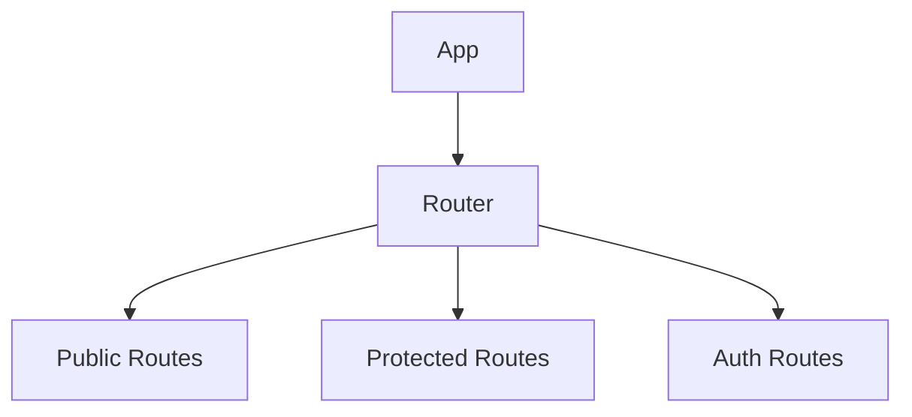
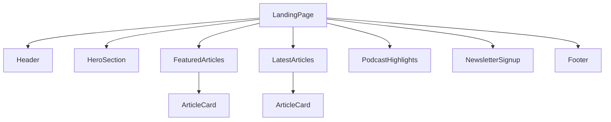
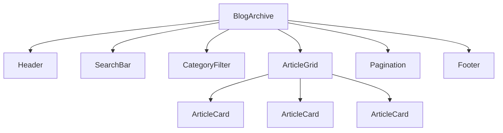
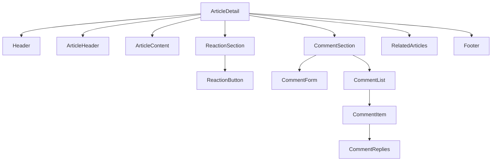
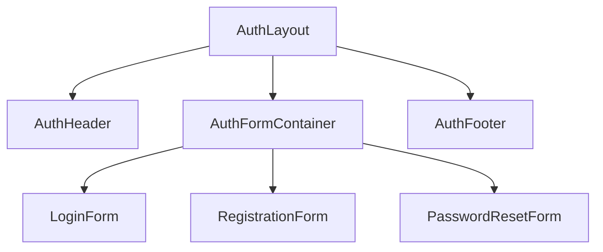
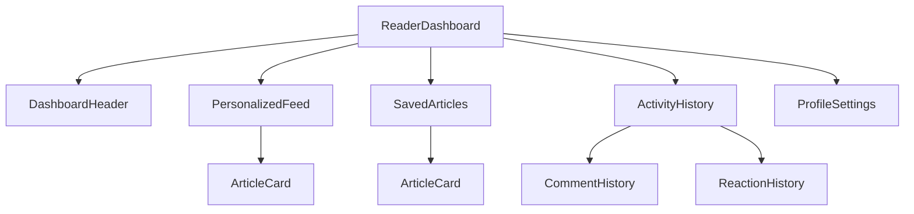
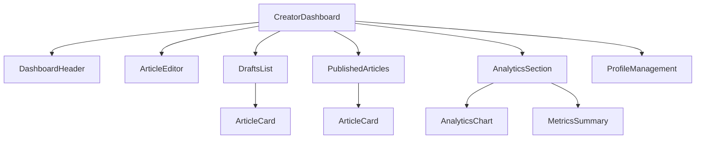
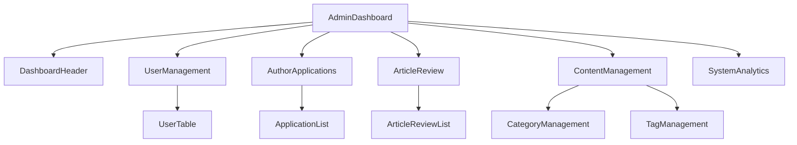
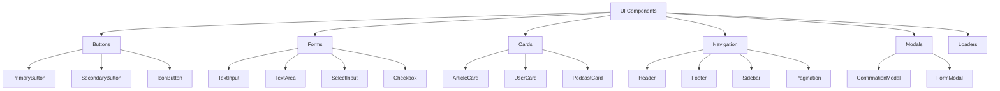
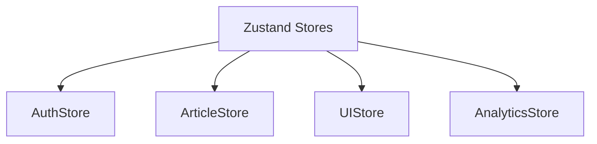

# Component Hierarchy for Medium-like Application

## Overview
This document outlines the component hierarchy for the Medium-like application, showing the relationship between different components and their responsibilities.

## Root Structure


## Public Routes


## Blog Archive


## Article Detail


## Authentication Routes


## User Dashboards

### Reader Dashboard


### Creator Dashboard


### Admin Dashboard


## Reusable Components


## State Management Components


## Data Fetching Components
```mermaid
graph TD
    A[TanStack Query] --> B[QueryClient]
    A --> C[QueryProvider]
    A --> D[CustomHooks]
    
    D --> D1[useArticles]
    D --> D2[useUsers]
    D --> D3[useComments]
    D --> D4[useReactions]